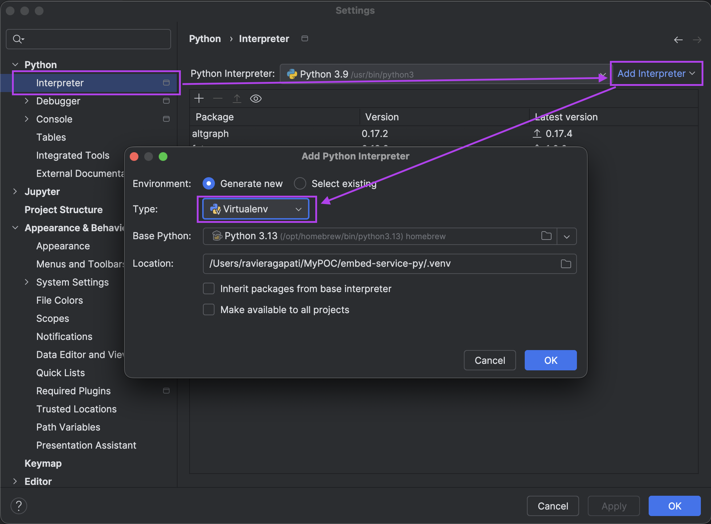

# embed-service-py
embedding model served as API built using python




```commandline
    pip freeze > requirements.txt
```

```commandline 
    pip install -r requirements.txt
```


## Request:

```cURL
    curl --location 'localhost:8000/v1/embeddings' \
    --header 'Content-Type: application/json' \
    --data '{
        "input": [
            "hello world",
            "The earth is round."
        ]
    }'
```

## Response: 

```JSON
    {
        "data": [
            {
                "index": 0,
                "embedding": [
                    -0.939453125,
                    -0.7216796875,
                    -0.79541015625,
                    -0.8974609375,
                    -0.6494140625,
                  .
                  . // 1024-dimensional embeddings.
                ]
            },
            {
                "index": 1,
                "embedding": [
                    -0.94091796875,
                    -0.59228515625,
                    -0.14892578125,
                    -0.94384765625,
                    -0.64111328125,
                    .
                    .
                ]
            }
        ]
    }
```